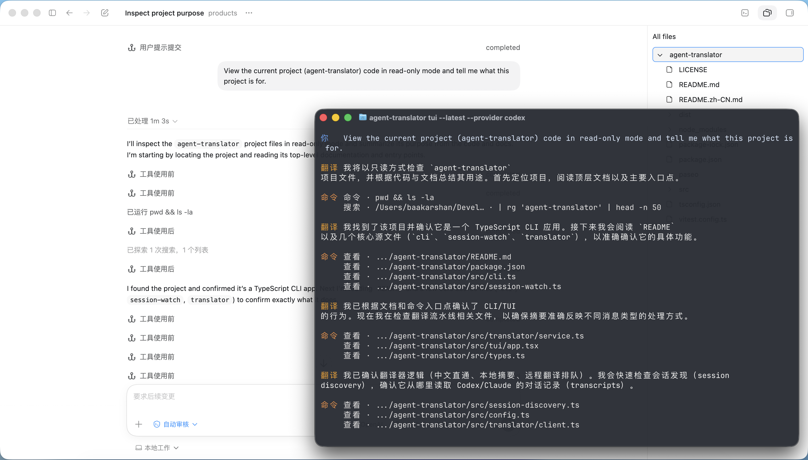

# Agent Translator TUI v1.1

English README: [README.md](./README.md)

这是一个只读的中文阅读 TUI，支持 Codex 和 Claude Code。

它保留原生 agent 在原终端里运行，同时在单独的 TUI 窗口中显示中文结果：

- 普通自然语言回复会翻译成简体中文
- 如果 assistant 本身输出的已经是中文，则直接原样显示，不再重复发给模型翻译
- Markdown 表格在可行时会渲染成终端里的 box table
- 代码块、命令、工具调用、diff、shell 风格输出会改写成简洁中文摘要
- 长会话采用串行翻译队列，尽量减少瞬时大量请求导致的 `429`

## 截图

项目截图统一放在 `docs/screenshots/` 目录下。

当前示例展示的是：左侧为 Codex 桌面端对话，右侧为只读的中文翻译 TUI。



## 依赖

- Node.js 20+
- `--tui` 自动新开窗口当前仅支持 macOS
- 本机已安装原生 `codex` 和/或 `claude` CLI

## 安装

```bash
cd /Users/baakarshan/Developer/products/agent-translator
cp .env.local.example .env.local
npm install
npm run install:global
```

安装完成后可直接使用全局命令：

```bash
agent-translator --help
```

## 本地配置

在 `.env.local` 中填写翻译模型配置：

```bash
AGENT_TRANSLATOR_API_KEY=your-api-key
AGENT_TRANSLATOR_BASE_URL=https://apicodex.xyz
AGENT_TRANSLATOR_MODEL=gpt-5.2
```

- `AGENT_TRANSLATOR_BASE_URL` 现在是必填项，项目不再内置默认远程网关。
- `.env.local` 已被 gitignore，真实 key 只应放在本地，不要提交进仓库。

如果你的兼容网关接口是 `/v1/responses`，则把 `base_url` 写成：

```bash
AGENT_TRANSLATOR_BASE_URL=https://your-host/v1
```

## 用法

在当前终端运行 Codex，并自动打开单独的中文 TUI：

```bash
agent-translator codex --tui
```

在当前终端运行 Claude Code，并自动打开单独的中文 TUI：

```bash
agent-translator claude --tui
```

只打开 TUI，并附着到最新会话：

```bash
agent-translator tui --latest --provider codex
agent-translator tui --latest --provider claude
```

附着到指定 session id：

```bash
agent-translator tui --provider codex --session <id>
agent-translator tui --provider claude --session <id>
```

## TUI 按键

- `Ctrl+C` 或 `q`：退出
- `b`：返回会话列表
- 方向键：在会话列表中选择
- `Enter`：从会话列表附着

正文浏览恢复为终端原生滚动，Ghostty 或 Terminal.app 中都可以继续用触控板双指上下滑动。
当前只会在 transcript 实际显示内容发生变化时才刷新，不再因为无关快照抖动反复重绘。

## 输出标签

- `你`：用户消息，保留原文
- `翻译`：普通自然语言或表格的中文结果
- `命令` / `工具` / `代码` / `改动` / `输出` / `表格`：按类型显示的中文结果
- `状态`：等待生成、生成中、失败等状态提示

## 渲染说明

- 当前配色改成更接近 Claude Code 的低噪音暖色系，而不是高饱和强调色。
- 简单 Markdown 表格会被转成终端 box table，阅读时更接近真正的表格，而不是原始 `|` 管道文本。
- 正文依然是终端文本渲染，不是完整富文本 Markdown 编辑器；标题、列表、长段落仍然遵循终端自身换行行为。
- Codex 的 `exec_command` 和 `apply_patch` 会重新整理成可读的 `命令` / `工具` 行，便于看到执行了什么、改了什么，而不会把原始 JSON 参数直接刷到主界面。
- 命令和工具摘要会优先在本地即时生成并直接缓存，尽量减少后台额外刷新对滚动体验的干扰。

## 会话匹配

包装命令会把当前工作目录传给 TUI，所以 `agent-translator codex --tui` 和 `agent-translator claude --tui` 会优先附着到当前项目目录下的最新会话，而不是跳到别的项目。

macOS 下默认会优先尝试用 `/Applications/Ghostty.app` 打开 TUI；如果 Ghostty 无法启动，则自动回退到 Terminal.app。

如果你在 Codex 桌面端里和 agent 对话，也可以直接用对应 session id 附着到这条会话；桌面端和 CLI 读取的是同一套 `~/.codex/sessions/` 会话文件。

## 隐私与安全

- 仍需远程生成的 assistant 内容，会按原文发送到你配置的翻译网关。
- `AGENT_TRANSLATOR_BASE_URL` 必须只指向你信任的后端，因为发送内容里可能包含项目文本、代码片段、路径和命令结果摘要。
- `.env.local` 只用于本地配置，不应进入版本控制。
- 本地翻译缓存和 debug 日志保存在 `~/.agent-translator/`。

## 自检

```bash
npm run verify
npm audit
```

## 开源前检查

在推到 GitHub 之前，先执行：

```bash
git status --short
git ls-files
```

重点确认：

- `.env.local` 没有被跟踪
- 临时 API key 已经轮换
- `npm run verify` 通过
- `npm audit` 没有已知漏洞
- README 示例里没有真实密钥

确认后再发布仓库：

```bash
git remote add origin git@github.com:<your-account>/agent-translator.git
git push -u origin main
```
